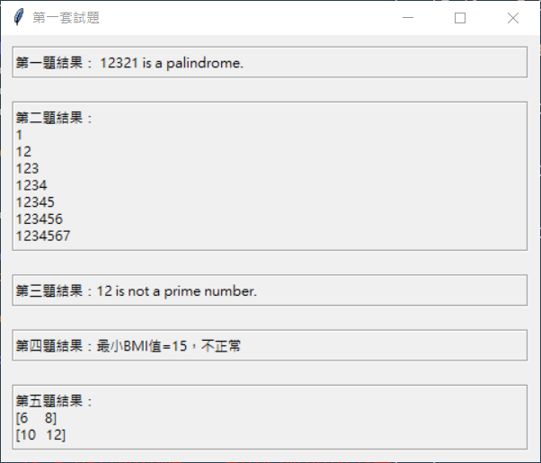
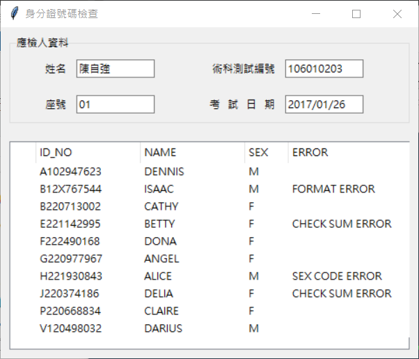
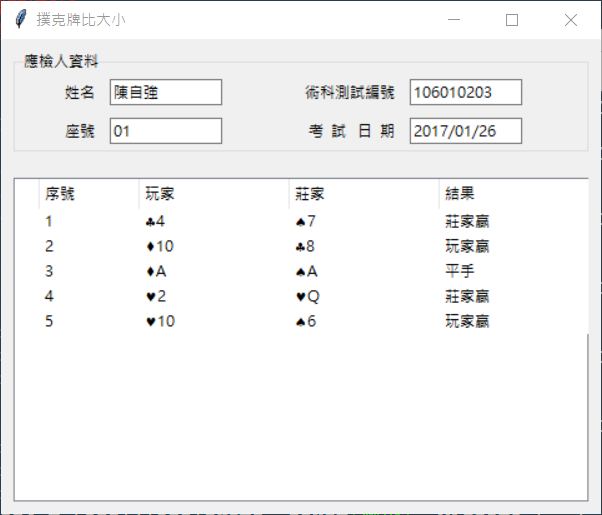
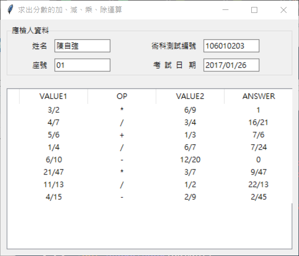

# Computer_Software_Design_Level-C_Python

# 丙級電腦軟體設計技術士 - 術科 (使用 Python)

**編程日期:** 2021/2/25

**術科題目:**

* 1060301 - 迴文判斷 
* 1060302 - 直角三角形列印
* 1060303 - 質數計算
* 1060304 - 體質指數BMI
* 1060305 - 矩陣相加  
  

* 1060306 - 身分證號碼檢查  
  

* 1060307 - 撲克牌比大小  
  

* 1060308 - 分數加、減、乘、除運算  
  

  
